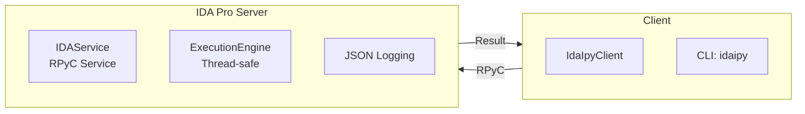

# CLAUDE.md

This file provides guidance to Claude Code (claude.ai/code) when working with code in this repository.

## Project Overview

IdaIpy is an RPyC-based IDA Pro remote execution plugin for macOS/Linux/Windows (IDA 9.0/9.1/9.2). It allows executing Python code remotely in IDA from external scripts, without needing to use the IDA console directly.

## Architecture



**Server (IDA plugin)**: `server/plugin/`
- `plugin.py` — IDA plugin with IdaIpyPlugin class, Ctrl+Shift+R toggles server
- `service.py` — RPyC Service exposing remote methods + task queue
- `executor.py` — Thread-safe execution engine (IDA API must run on main thread)
- `config.py` — HOST/PORT/TIMEOUT/DEBUG settings
- `__init__.py` — Logging utilities (log/dbg/log_json)

**Client**: `client/src/idaipy/`
- `client.py` — RPyC client wrapper with Result type, auto-retry, async tasks
- `result.py` — Result dataclass for unified return types
- `cli.py` — Command-line tool `idaipy`

## Project Structure

```text
idaipy/
├── client/              # Python client package
│   ├── src/idaipy/     # Source code (import: from idaipy import ...)
│   ├── docs/           # Client documentation
│   └── pyproject.toml
├── server/             # IDA plugin
│   ├── plugin/         # Plugin directory (installed to IDA)
│   │   ├── idaipy_plugin.py  # Entry point
│   │   ├── __init__.py
│   │   ├── config.py
│   │   ├── executor.py
│   │   ├── plugin.py   # IdaIpyPlugin class
│   │   └── service.py
│   └── docs/           # Server documentation
├── scripts/            # Installation script only
│   └── install_plugin.py
├── tools/              # Utility scripts
├── tests/              # Test scripts
├── docs/               # Documentation
└── example/            # Example scripts
```

## Key Concepts

### Result Type

All exec operations return a `Result` dataclass:

```python
from idaipy import IdaIpyClient, Result

with IdaIpyClient() as c:
    r = c.run_script("script.py")
    r.raise_if_error()  # Raises RuntimeError if status is "error"
    print(r.stdout)
```

Properties:
- `r.ok` — `True` if status is "ok"
- `r.status` — "ok" or "error"
- `r.stdout` / `r.stderr` — captured output
- `r.error_type` / `r.error_message` / `r.traceback` — error details (if error)

### Three Usage Modes

**Mode 1 - Standalone CLI:**
```bash
idaipy run script.py
```

**Mode 2 - Pip package:**
```python
from idaipy import IdaIpyClient
```

**Mode 3 - Development import:**
```python
import sys
sys.path.insert(0, "/path/to/idaipy/client/src")
from idaipy import IdaIpyClient
```

### Execution Modes

IDA 9.x APIs must run on the main thread. The executor provides two modes:
- `main_read` — Main thread with read lock (for reading IDA info, recommended)
- `main_write` — Main thread with write lock (for modifying IDA database)

### Connection Retry

`IdaIpyClient` automatically retries connections with exponential backoff (3 attempts, 1s/2s/4s):

```python
# Disable retry
client = IdaIpyClient(retry=0)

# Custom retry count
client = IdaIpyClient(retry=5)
```

### Async Tasks

```python
# Submit async task
task_id = c.exec_async("import time; time.sleep(10); print('done')")

# Wait for result
result = c.wait_task(task_id, timeout=30)
result.raise_if_error()
print(result.stdout)

# Or poll manually
status = c.task_status(task_id)
print(status["status"])  # 'pending' | 'running' | 'done' | 'cancelled'

# Cancel a task
c.cancel_task(task_id)

# List all tasks
tasks = c.list_tasks()
```

### Workspace

Set a project directory via `set_workspace(path)` — server adds it to `sys.path` and injects `WORKSPACE` variable into execution environment.

### Push Modules

Alternative to workspace: `push_modules(file_map)` pushes local .py files to server temp directory for remote import.

### Token Authentication

Server supports optional token authentication via `IDAIPY_TOKEN` env var. When set, clients must pass `token=...` to exec methods.

### Structured Logging

Server writes JSON logs to `~/.idaipy/logs/idaipy.log` (configurable via `IDAIPY_LOG_DIR`). Events include: connect, disconnect, exec, error, auth_success, auth_failure, shutdown.

## Commands

### Install Plugin to IDA
```bash
# Auto-detect IDA installation (macOS/Linux/Windows)
python3 scripts/install_plugin.py

# Manual path
python3 scripts/install_plugin.py --ida-path "/Applications/IDA Pro 9.2.app"
```
After install, press **Ctrl+Shift+R** in IDA to start/stop server.

### Run Tests
```bash
# Requires IDA running with a file opened, server started (Ctrl+Shift+R)
python3 tests/test_plugin.py    # 46 tests
python3 tests/test_module.py    # 15 tests
```

### Install Client
```bash
# Development mode (editable)
pip install -e client/

# Or pip install
pip install idaipy
```

### CLI Usage
```bash
idaipy ping                        # Health check
idaipy status                      # Server status
idaipy log --lines 50              # View log file
idaipy log --lines 50 --json      # View log as JSON
idaipy run script.py               # Execute script
idaipy run script.py -v            # Execute with verbose traceback
idaipy run script.py --timeout 300 # Execute with custom timeout
idaipy run-project my_project      # Run project
```

## Client API

```python
from idaipy import IdaIpyClient, Result

# Basic usage
with IdaIpyClient(workspace="/path/to/project") as c:
    r = c.run_script("script.py")
    r.raise_if_error()
    print(r.stdout)

# Run project with entry point
with IdaIpyClient() as c:
    r = c.run_project("example/my_analysis", entry="main.py")

# Parse JSON from stdout
data = c.run_script_json("script.py")

# Connection management
c.connect()
print(c.is_connected())  # True/False
c.ping()   # {'status': 'ok', 'pong': ...}
c.status() # {'status': 'ok', 'data': ...}
c.close()

# Async tasks
task_id = c.exec_async("import time; print('done')")
result = c.wait_task(task_id, timeout=30)
c.cancel_task(task_id)
c.list_tasks()

# Batch execution
task_id = c.exec_batch(list_of_items, chunk_size=10, yield_ms=100)
```

## Server Configuration

Edit `server/plugin/config.py`:
- `HOST = "127.0.0.1"` — Only localhost (security)
- `PORT = 7123` — Default port
- `TIMEOUT = 300` — 5 minute timeout
- `DEBUG = False` — Enable debug logging

### Environment Variables

| Variable | Purpose | Default |
|----------|---------|---------|
| `IDAIPY_TOKEN` | Token authentication | (none) |
| `IDAIPY_LOG_DIR` | Log file directory | `~/.idaipy` |
| `IDAIPY_ALLOW_PICKLE` | Enable pickle (security risk!) | `0` |

## Thread Safety

IDA API calls must go through `ExecutionEngine` which uses `idaapi.execute_sync()` to run code on IDA's main thread. Direct RPyC module access (`conn.modules["idc"]`) works for read queries but write operations require explicit main-thread execution.

## Testing Notes

Tests are read-only operations that verify IDA API functionality (file info, segments, functions, disassembly, decompilation, memory read, instruction decode, xrefs, strings). All 61 tests pass when IDA has a file open and server is running.
