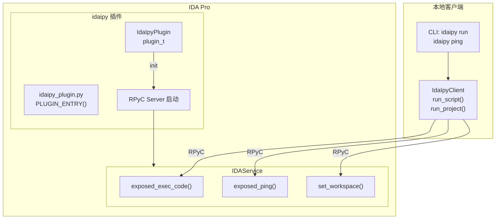
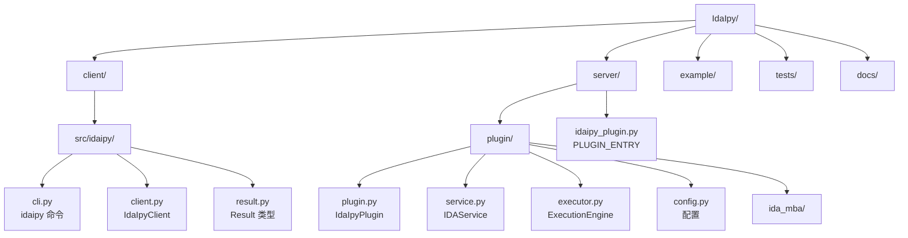
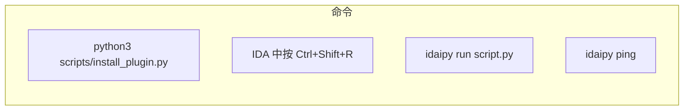

# IdaIpy 整体架构

## 1. 整体架构

```mermaid
flowchart TB
    subgraph IDA["IDA Pro"]
        subgraph IdaIpyPlugin["idaipy 插件"]
            PluginEntry["idaipy_plugin.py<br/>PLUGIN_ENTRY()"]
            PluginClass["IdaIpyPlugin<br/>plugin_t"]
            PluginClass --> |init| ServerStart["RPyC Server 启动"]
        end

        subgraph RPyC_Service["IDAService"]
            ExecCode["exposed_exec_code()"]
            Ping["exposed_ping()"]
            Workspace["set_workspace()"]
        end

        ServerStart --> RPyC_Service
    end

    subgraph Client["本地客户端"]
        CLI["CLI: idaipy run<br/>idaipy ping"]
        ClientLib["IdaIpyClient<br/>run_script()<br/>run_project()"]
    end

    CLI --> ClientLib
    ClientLib --> |RPyC| ExecCode
    ClientLib --> |RPyC| Ping
    ClientLib --> |RPyC| Workspace
```

---

## 2. 项目目录结构

```mermaid
graph TB
    Root["IdaIpy/"]
    Root --> Client["client/"]
    Root --> Server["server/"]
    Root --> Example["example/"]
    Root --> Tests["tests/"]
    Root --> Docs["docs/"]

    Client --> ClientSrc["src/idaipy/"]
    ClientSrc --> Cli["cli.py<br/>idaipy 命令"]
    ClientSrc --> ClientLib["client.py<br/>IdaIpyClient"]
    ClientSrc --> Result["result.py<br/>Result 类型"]

    Server --> ServerPlugin["plugin/"]
    ServerPlugin --> PluginPy["plugin.py<br/>IdaIpyPlugin"]
    ServerPlugin --> ServicePy["service.py<br/>IDAService"]
    ServerPlugin --> ExecutorPy["executor.py<br/>ExecutionEngine"]
    ServerPlugin --> ConfigPy["config.py<br/>配置"]
    ServerPlugin --> IdaMba["ida_mba/"]

    Server --> IdaipyEntry["idaipy_plugin.py<br/>PLUGIN_ENTRY"]
```

---

## 3. 快速命令参考

```mermaid
graph LR
    subgraph Commands["命令"]
        Install["安装插件"]
        Start["启动服务器"]
        Run["执行脚本"]
        Ping["健康检查"]
    end

    Install["python3 scripts/install_plugin.py"]
    Start["IDA 中按 Ctrl+Shift+R"]
    Run["idaipy run script.py"]
    Ping["idaipy ping"]
```
