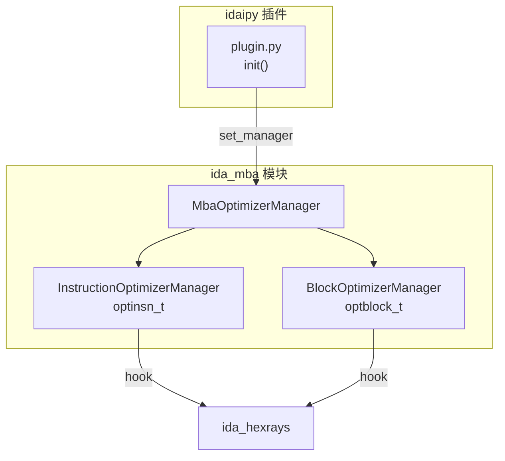
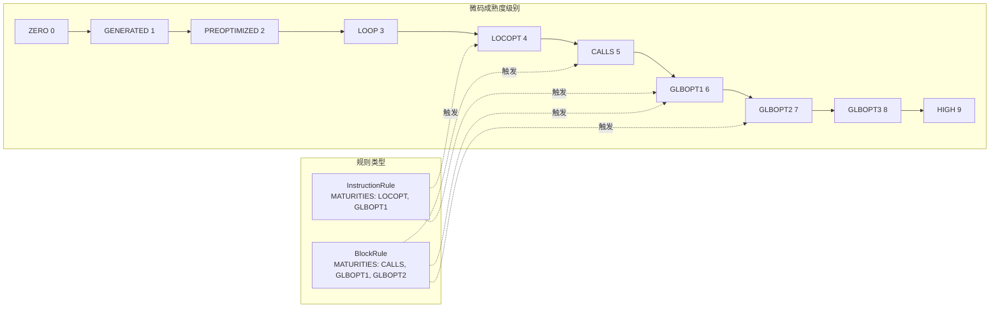
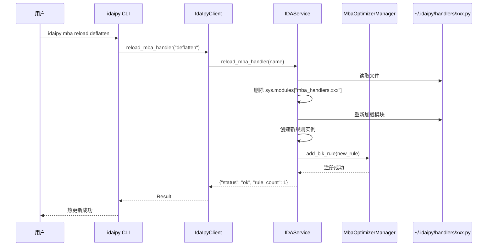
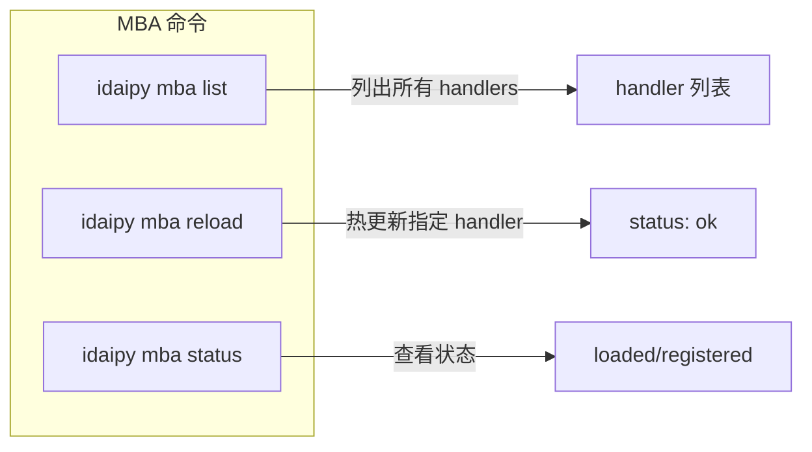

# IdaIpy MBA 微码优化框架

## 1. MBA 模块架构



---

## 2. 微码 Maturity 流程



---

## 3. Handler 热更新流程



---

## 4. MBA 命令



---

## 5. Handler 开发

### 文件位置

```
~/.idaipy/handlers/
├── deflatten.py      # 控制流反扁平化
├── switch_fix.py     # switch 优化
└── ...
```

### Handler 示例

```python
from ida_mba.mba_optimizer import BlockRule, Maturity

class DeflattenRule(BlockRule):
    """检测并去除 OLLVM 控制流平坦化"""
    MATURITIES = [Maturity.CALLS, Maturity.GLBOPT1, Maturity.GLBOPT2]

    def optimize(self, blk) -> int:
        # 检测分发器块
        if len(list(blk.predset)) > 10:
            return 0  # TODO: 实现 CFG 重构
        return 0

RULE = DeflattenRule
```

### 注册方式

| 方式 | 说明 |
|------|------|
| `RULE = MyRule` | 单个规则 |
| `HANDLERS = [("name", rule_instance), ...]` | 多个规则 |

---

## 6. 规则类型

| 类型 | 基类 | 默认 Maturity | 用途 |
|------|------|---------------|------|
| 指令规则 | `InstructionRule` | LOCOPT, GLBOPT1 | 指令级转换 |
| 块规则 | `BlockRule` | CALLS, GLBOPT1, GLBOPT2 | 块级转换 |

### 方法签名

```python
class InstructionRule:
    def optimize(self, blk, ins) -> bool:
        """优化指令，返回 True 表示进行了修改"""
        raise NotImplementedError

class BlockRule:
    def optimize(self, blk) -> int:
        """优化块，返回修改数量"""
        raise NotImplementedError
```
