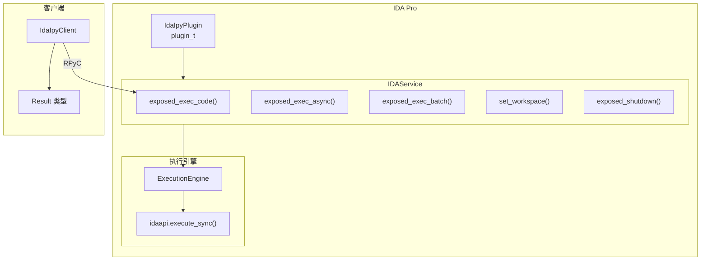
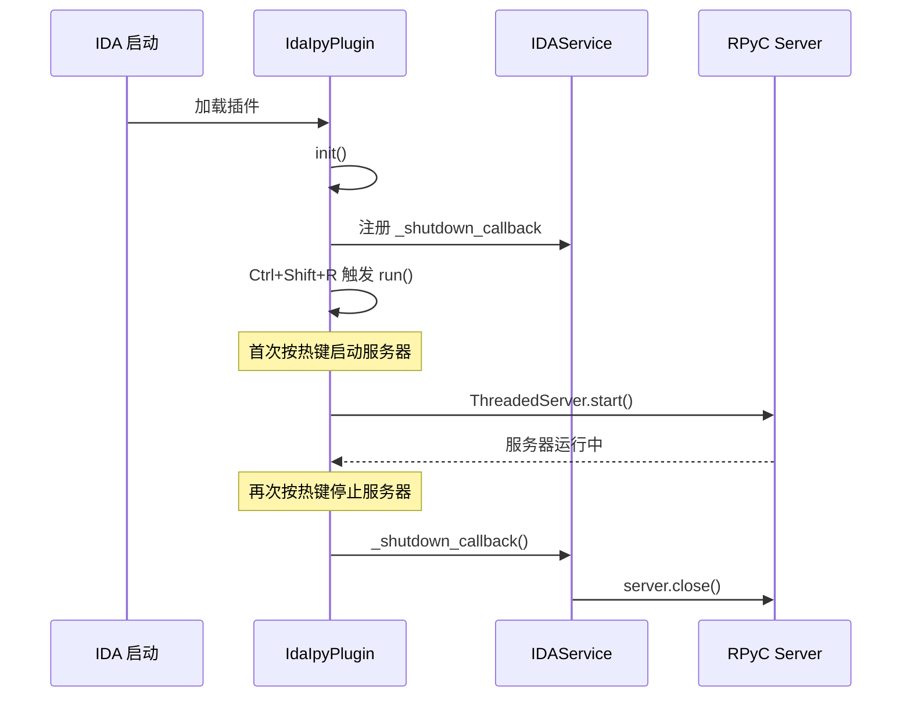
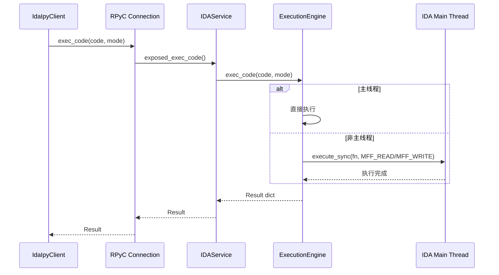
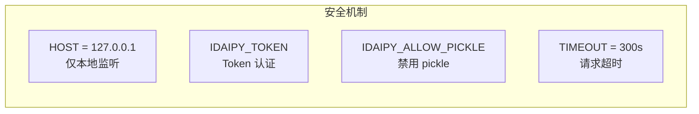

# IdaIpy 插件框架

## 1. 插件架构

---

## 2. 插件初始化流程

---

## 3. 代码执行流程

---

## 4. 安全机制

---

## 5. 配置参数

| 参数 | 默认值 | 说明 |
|------|--------|------|
| `HOST` | `127.0.0.1` | 仅本地监听 |
| `PORT` | `7123` | 默认端口 |
| `TIMEOUT` | `300` | 5 分钟超时 |
| `DEBUG` | `False` | 调试日志 |

### 环境变量

| 变量 | 用途 |
|------|------|
| `IDAIPY_TOKEN` | Token 认证 |
| `IDAIPY_LOG_DIR` | 日志目录 `~/.idaipy` |
| `IDAIPY_ALLOW_PICKLE` | 启用 pickle（安全风险） |
